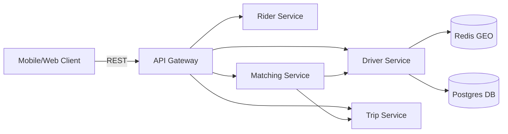

# 🚖 Ride-Handling Microservices

A modular, production‑grade **ride‑hailing MVP** built with **Go**, **gRPC**, **Redis**, **Postgres**, and **Fiber**.
This project demonstrates a clean microservice architecture with clear service boundaries, ergonomic configs, and reproducible builds.

---

## 📂 Project Structure
```
├── proto/                      # Shared Protocol Buffer (protobuf) definitions
│   ├── common/v1/            # Common messages (e.g., GeoPoint, TripStatus)
│   ├── driver/v1/            # Driver-related gRPC services and messages
│   ├── rider/v1/             # Rider-related gRPC services and messages
│   ├── trip/v1/              # Trip lifecycle gRPC services and messages
│   └── matching/v1/          # Matching logic gRPC services (e.g., driver-rider assignment)
│
├── services/                   # Microservices implementation
│   ├── driver-svc/           # Manages driver status, heartbeat, and real-time location (uses Redis + PostgreSQL)
│   ├── rider-svc/            # Handles rider CRUD operations
│   ├── trip-svc/             # Orchestrates full trip lifecycle (creation, updates, completion)
│   ├── matching-svc/         # Implements matching algorithm and sends ride invitations
│   └── api-gateway/          # REST-to-gRPC gateway (built with Fiber), includes Swagger UI
│
└── docs/
    └── swagger.yaml          # OpenAPI specification for the public REST APIy
```


---

## 🏗 Architecture


> Driver Service: manages driver status, heartbeats, and nearby queries (Redis GEO + Postgres persistence).

> Rider Service: manages rider accounts.

> Trip Service: manages trip lifecycle (requested → assigned → ongoing → completed).

> Matching Service: finds nearby drivers and assigns them to trips.

> API Gateway: exposes REST endpoints for clients, translates to gRPC calls, and serves Swagger docs.

# ⚙️ Tech Stack
- Go 1.24+

- gRPC + Protocol Buffers

- Fiber (HTTP framework)

- Redis (driver location + GEO queries)

- Postgres (persistent storage)

- Docker Compose (local orchestration)

- Swagger/OpenAPI (API docs)

# 🚀 Getting Started
1. Clone & Build
```bash
git clone https://github.com/lhiradi/ride-handling.git
cd ride-handling
```
2. Generate Protobufs
```bash
cd proto
make gen
```
3. Run with Docker Compose
Create a docker-compose.yml (see example below) and run:

```bash
docker-compose up --build
```
🌐 API Endpoints (via Gateway)
### Riders

> POST /riders → create rider

> GET /riders/:id → get rider

Trips

> POST /trips → create trip

### Drivers

> POST /drivers/:id/status → set driver status

> POST /drivers/:id/heartbeat → send heartbeat

> Matching

>POST /match → find nearby drivers

> POST /accept → accept invitation

## 📖 Swagger / OpenAPI
- Interactive API docs are available via Swagger.

- Spec file: docs/swagger.yaml


## 🧪 Example Flow
Create Rider

```bash
curl -X POST http://localhost:8080/riders \
  -H "Content-Type: application/json" \
  -d '{"name":"Hirad","phone":"+989120000000"}'
Create Trip
```
```bash
curl -X POST http://localhost:8080/trips \
  -H "Content-Type: application/json" \
  -d '{"rider_id":"RID123","pickup_lat":35.7,"pickup_lon":51.4,"drop_lat":35.8,"drop_lon":51.5}'
Driver Heartbeat
```
```bash
curl -X POST http://localhost:8080/drivers/DRV123/heartbeat \
  -H "Content-Type: application/json" \
  -d '{"lat":35.71,"lon":51.41}'
Match
```
```bash
curl -X POST http://localhost:8080/match \
  -H "Content-Type: application/json" \
  -d '{"trip_id":"TRIP123","pickup_lat":35.7,"pickup_lon":51.4,"radius_km":3,"limit":5}'
Accept Invitation
```
```bash
curl -X POST http://localhost:8080/accept \
  -H "Content-Type: application/json" \
  -d '{"invitation_id":"INV123","trip_id":"TRIP123","driver_id":"DRV123"}'
```

📈 Next Steps
Add integration tests for end‑to‑end flows.

Implement driver expiry (remove inactive drivers from Redis).

Add observability (Prometheus metrics, structured logs, tracing).

Extend trip lifecycle (en route, ongoing, completed).

📜 License
BSD 2-Clause License

Code

---

✨ This README is now **comprehensive**: it explains the architecture, setup, endpoints, and Swagger usage.

Would you like me to also generate a **ready-to-use `docker-compose.yml`** that spin
